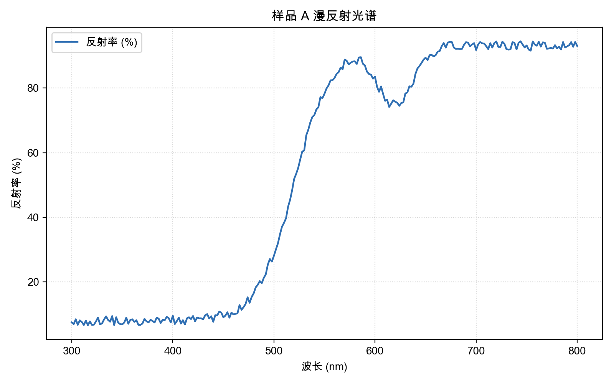

# lab-plotter

把实验数据 CSV 画成图的命令行小工具，用来处理光谱、XRD、称重这类实验数据。

## 为什么做这个

做实验时会反复遇到同一件事：把仪器导出的数据整理成一张能放进报告里的图。
每次手动拖进 Excel 调轴、加标题，既慢又容易前后不一致。
这个小工具把这件事变成一行命令，同样的数据每次都能得到同一张图。

## 功能

- 读取 CSV / TSV 数据，自动跳过 `#` 开头的注释行
- 指定任意两列作为横纵轴（支持列名或列序号）
- 自定义标题和坐标轴名称
- 可选线性拟合，输出斜率和 R²
- 输出 PNG 图片，命令行打印基本统计量

## 安装

```bash
python3 -m venv .venv
source .venv/bin/activate
pip install -r requirements.txt
```

## 用法

```bash
python plot_csv.py 示例数据/示例光谱.csv --x 波长 --y 反射率 \
    --title "样品 A 漫反射光谱" --xlabel "波长 (nm)" --ylabel "反射率 (%)"
```

生成的图保存在 `输出/示例光谱.png`。

常用参数：

| 参数 | 说明 |
| --- | --- |
| `--x` / `--y` | 横轴、纵轴的列名或列序号，默认第 0 列和第 1 列 |
| `--title` | 图标题 |
| `--xlabel` / `--ylabel` | 坐标轴名称 |
| `--out` | 输出路径，默认放到 `输出/` 下 |
| `--fit linear` | 做一次线性拟合，打印斜率和 R² |

## 示例输出



示例数据由 `示例数据/生成示例光谱.py` 生成，是一次模拟的漫反射光谱，
在 520 nm 附近有一个吸收边，在 620 nm 附近有一个吸收谷。

## 依赖

Python 3.9+ 和 matplotlib。
